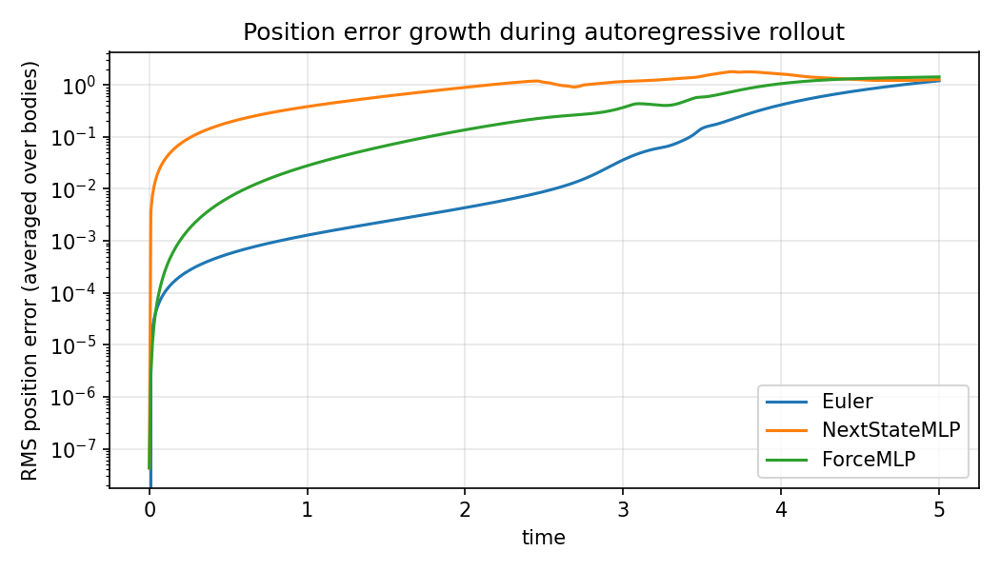
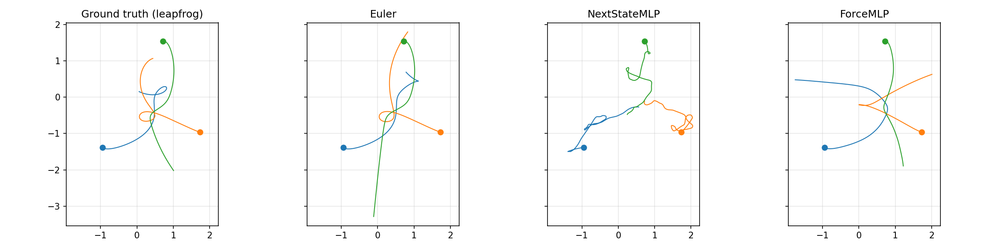
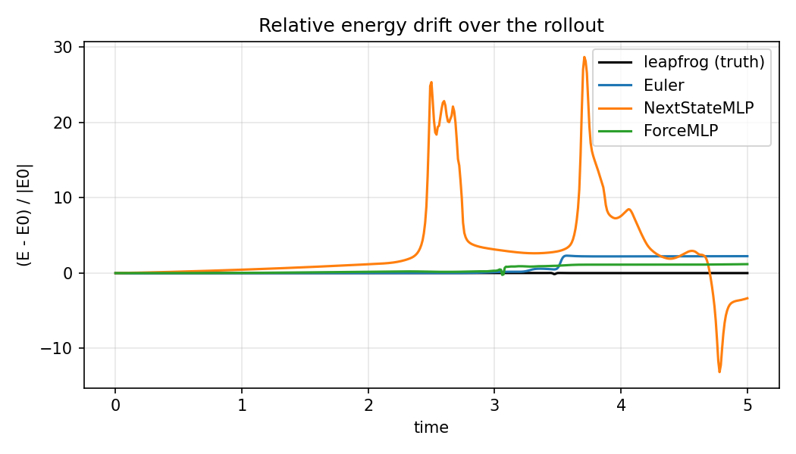
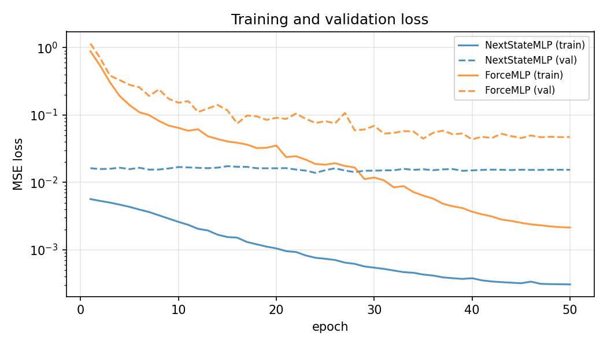

<<<<<<< HEAD
# nbody-physics_vs_naive_nn_training
"When you train a neural network to roll out a chaotic 3-body gravitational system, **how much does baking in physics structure actually help?**: Compared against a "predict the next state" MLP, a physics-aware network that only predicts accelerations and lets an integrator handle the rest is **~28× more accurate at short time scales**.
=======
# Learning gravity: physics-aware vs. naive neural integrators for the 3-body problem

Small investigation: "When you train a neural network to roll out a chaotic 3-body
gravitational system, **how much does baking in physics structure actually help?**:
Compared against a "predict the next state" MLP, a physics-aware
network that only predicts accelerations and lets an integrator handle
the rest is **~28× more accurate at short time scales** and tracks energy almost as
well as the leapfrog ground truth.



## The problem

The Newtonian N-body problem has no closed-form solution
for N ≥ 3, so trajectories are chaotic and have to be integrated numerically.
Classical integrators trade accuracy for speed, due to the need to simulate all variables frame by frame, neural networks promise speed
*and* accuracy if they can learn the dynamics. This project asks the natural
follow-up: does the network need to learn the *whole* dynamics, or only the
hard part?

I compared two networks that span the inductive spectrum:

| Model | What it predicts | Physics baked in                                                                                            |
|-------|------------------|-------------------------------------------------------------------------------------------------------------|
| `NextStateMLP` | full next state `s_{t+1}` from `s_t` | none, pure black box                                                                                        |
| `ForceMLP` | accelerations `a(x)` from positions only | Newton's second law (forces depend on positions, not velocities); leapfrog integrator for the time-stepping |

The architectures (4-layer, 256-wide MLPs) and training data are identical (constants).
The only independent variable is how much physics structure the model is allowed
to assume.

## Setup

- **System.** 2-D, 3 equal-mass bodies, `G = 1`, softening `ε = 10⁻³` to keep
  forces finite during near-encounters (d ~ 0). Reference integrator is velocity-Verlet
  (leapfrog), which conserves energy on average to ~10⁻⁵
  over 5 time units.
- **Dataset.** 210 trajectories × 500 steps × dt = 0.01. Random initial conditions with
  zero net momentum; trajectories with > 50% energy drift (i.e. an integrator
  blow-up) are filtered out.
- **Splits.** 80/10/10 by trajectory (not by timestep) so the test set is
  truly unseen ICs and the network can't memorise.
- **Training.**  50 epochs each. Both inputs and
  acceleration targets are standardised to unit variance. For the force
  model, samples with `|a|_∞ > 50` (close encounters) are dropped. Those
  are physical singularities, where standard laws of conservation of energy and momentum aren't followed even by the leapfrog approach, not the smooth-gravity regime we want to learn.

## Results

### Trajectory rollout

500-step autoregressive rollout from a held-out test IC, plotted against the
leapfrog ground truth and forward-Euler (a deliberately bad classical
baseline).



`NextStateMLP` loses the qualitative shape of the orbit almost immediately;
`ForceMLP` preserves the truth visually for most of the rollout but diverges
once the chaotic singularity is reached. The paths seem to be appproximated, losing some of their detail.

### Position error vs. time

| time | `NextStateMLP` | `ForceMLP` |                       improvement |
|-----:|---------------:|-----------:|----------------------------------:|
| t = 0.50 | 1.9 × 10⁻¹ | 6.7 × 10⁻³ |                          **~28×** |
| t = 1.25 | 4.9 × 10⁻¹ | 4.5 × 10⁻² |                          **~11×** |
| t = 2.50 | 1.12 (saturated) | 0.23 |                           **~5×** |
| t = 5.00 | 1.27 | 1.43 | both chaotic, diverged from truth |

By t ≈ 5 both models have hit chaos, 
so the *final* error doesn't separate them. It's the rate at which the error grows which truly demonstrates the improvement of the ForceMLP over the näive NextStateMLP. 

### Energy conservation

This is the result I find most interesting. Energy is a global, non-trivial
function of the state; nothing in the loss explicitly trains for it.



`ForceMLP`'s energy stays effectively flat (it inherits the symplectic
property from the leapfrog integrator, small force errors don't accumulate
into systematic drift). In fact, at larger time scales, it preserved energy better than the Eulerian approach. `NextStateMLP`s energy, after, t=2.5, grows extremely fast, with chaos because it lacks any understanding or rules to prevent total energy from changing.

### Loss curves



Surprisingly, `NextStateMLP` looks better in pure validation MSE. This is because its target
(`s_{t+1} − s_t`) is tiny for `dt = 0.01`. In short, NextStateMLP's methodology optimizes itself for the test of position since that is what it tries to predict. However, the ForceMLP tries to predict acceleration based off positions, and it approximates position based off the leapfrog integration. So, the NextStateMLP outperforms in the short term, but falls short compared to the ForceMLP in the long term because of its lack of underlying understanding. 
This is visible in the first graph, as at times close to 0, the ForceMLP (green) momentarily has a larger error than the NextStateMLP (yellow).
## Takeaways

1. **Inductive bias beats raw capacity.** With identical architectures and
   data, restricting the network to predict only forces (and letting a
   century-old integrator handle the rest) gives orders-of-magnitude better
   rollouts.
2. **Validation loss is a bad proxy for rollout quality** when the target
   distribution is biased toward small numbers (state deltas). Rollout
   error growth and conserved-quantity drift are far more honest metrics.
3. **Symplectic structure is "free" energy conservation.** The force model
   inherits ~zero secular energy drift from the leapfrog integrator without
   any energy term in the loss.
4. **Target normalisation is load-bearing.** With softening `ε = 10⁻³`,
   raw acceleration magnitudes span ~6 orders of magnitude. A small-init
   linear head can't produce those values; standardising the targets and
   filtering close-encounter spikes was the difference between the force
   model losing to and decisively beating the naive baseline.

## Repository layout

```
nbody/
  system.py        # Newtonian N-body system: leapfrog & Euler integrators, energy/momentum diagnostics
  data.py          # Trajectory generation, train/val/test split, .npz I/O
  models.py        # NextStateMLP and ForceMLP
  train.py         # Training loops with per-feature input/target normalisation
  eval.py          # Rollouts, metrics, all the plots in this README
data/train.npz     # 210 trajectories × 500 steps (regenerable from data.py)
checkpoints/       # Trained model weights
figures/           # Plots
```

## Reproducing

```bash
pip install -r requirements.txt

# regenerate the dataset (skip if data/train.npz already exists)
python -m nbody.data

# train both models (~1 min each on CPU)
python -m nbody.train --model all --data data/train.npz --epochs 50

# rollouts, metrics, and all five figures
python -m nbody.eval --data data/train.npz
```

## References

- Chenciner, A. & Montgomery, R. (2000). *A remarkable periodic solution of
  the three-body problem in the case of equal masses.* Annals of Mathematics.
- Hairer, E., Lubich, C. & Wanner, G. (2006). *Geometric Numerical Integration.*
  Springer. (Chapter on symplectic integrators / leapfrog.)
- Sanchez-Gonzalez, A. et al. (2019). *Hamiltonian Graph Networks with ODE
  Integrators.* arXiv:1909.12790. (Same idea taken further: learn the
  Hamiltonian, integrate it.)
>>>>>>> 6a827ff5 (Initial commit - Full Project)
